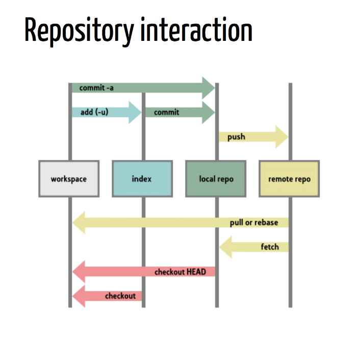

Quick start guide to git and github
=========

[Common commands](https://github.github.com/training-kit/downloads/github-git-cheat-sheet/)

[GitHub glossary](https://docs.github.com/en/github/getting-started-with-github/github-glossary)

There are two git / GitHub cheat sheets in the cheat sheets folder [here](https://github.com/brianspiering/computation_course/tree/master/resources/cheat_sheets)